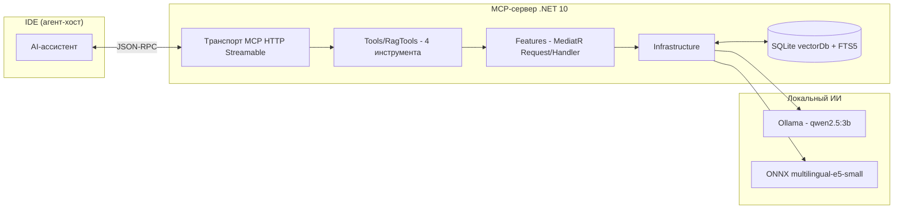
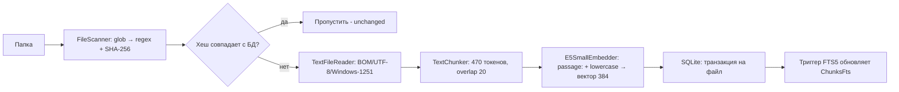
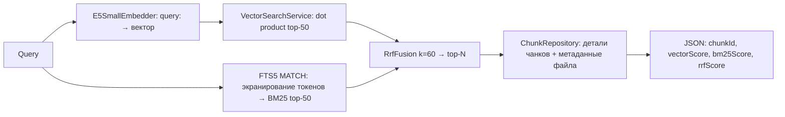
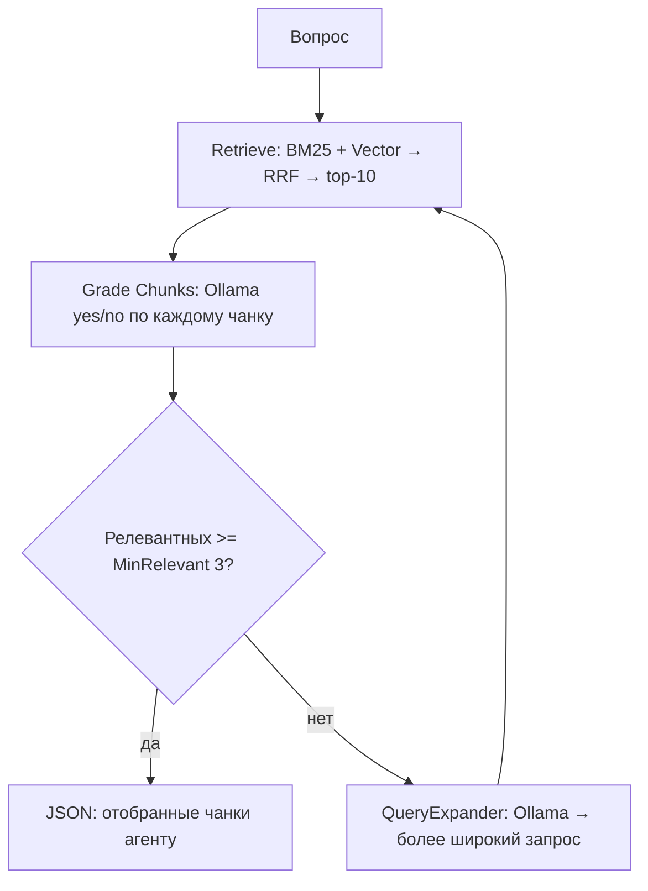

# Архитектура: MCP-сервер Corrective RAG

Документ описывает фактическую архитектуру проекта `otus-projectwork-rag` — MCP-сервера,
который превращает локальную папку с документами в поисковую базу знаний с Corrective
RAG-пайплайном. Содержимое соответствует текущему состоянию исходного кода
([`Program.cs`](Program.cs:1), [`appsettings.json`](appsettings.json:1)) и дополняет
память проекта ([`.agents/memory-bank/02-architecture.md`](.agents/memory-bank/02-architecture.md:1)).

---

## 1. Назначение

Разработчик подключает сервер к IDE (Copilot, Claude и др.) по протоколу MCP,
индексирует папку с документами и задаёт вопросы. Сервер:

- индексирует файлы: чанкинг → эмбеддинги (ONNX `multilingual-e5-small`, 384 измерения)
  → SQLite (`vectorDb.db`) + полнотекстовый индекс FTS5 (BM25);
- выполняет гибридный поиск: векторный + BM25 → Reciprocal Rank Fusion (RRF) → топ-10;
- «корректирует» результат через локальную LLM (Ollama): грейдинг релевантности чанков
  (yes/no) и расширение запроса при недостатке релевантных (до 2 итераций).

**Ключевое правило:** сервер НЕ генерирует финальный ответ. Он возвращает агенту-хосту
JSON с чанками и метаданными (файл, `chunkId`, оценки близости), а ответ формулирует сам
агент-хост в IDE.

---

## 2. Технологический стек

| Технология | Версия | Роль |
|---|---|---|
| .NET / ASP.NET Core | net10.0 | Хост MCP-сервера (HTTP-транспорт Streamable, Stateless) |
| [ModelContextProtocol.AspNetCore](https://www.nuget.org/packages/ModelContextProtocol.AspNetCore) | 2.1.0 | Официальный C# SDK MCP |
| Microsoft.Data.Sqlite | 10.0.12 | SQLite: текст, векторы, FTS5 |
| Microsoft.ML.OnnxRuntime | 1.30.0 | Инференс модели эмбеддингов |
| Tokenizers.HuggingFace | 3.23.1 | Токенизация (`tokenizer.json` модели) |
| MediatR | 12.5.0 | Запросы/обработчики (Request и Handler рядом) |
| Serilog.AspNetCore / Serilog.Sinks.File | 10.0.0 / 7.0.0 | Логирование: stdout + файл, от уровня Information |
| Ollama (OpenAI-совместимый `/v1`) | — | Грейдинг релевантности чанков + расширение запроса |

Зависимости объявлены в [`otus-projectwork-rag.csproj`](otus-projectwork-rag.csproj:53).

---

## 3. Общая схема



---

## 4. Структура решения

```
otus-projectwork-rag/
├── Program.cs                     # DI, Serilog, MediatR, регистрация MCP, /health, схема БД
├── appsettings.json               # секции Database, Embedding, Chunking, Indexing, Retrieval, Ollama, Serilog
├── otus-projectwork-rag.csproj    # net10.0, пакеты, копирование ресурсов, native self-extract
├── Configuration/AppOptions.cs    # строго типизированные опции (по секциям appsettings)
├── Contracts/                     # DTO результатов (records): IndexFolderResult, SearchResult,
│                                  #   ChunkDetail, RelevantChunkResult, AskQuestionResult, IndexStatusResult
├── Domain/                        # сущности: Document, Chunk, Embedding
├── Infrastructure/
│   ├── AppPaths.cs                # разрешение относительных путей (рабочий каталог → каталог приложения)
│   ├── Data/
│   │   ├── SqliteConnectionFactory.cs  # WAL, внешние ключи, создание каталога БД
│   │   ├── SchemaInitializer.cs        # DDL, индексы, FTS5, триггеры
│   │   └── Repositories/
│   │       ├── DocumentRepository.cs   # Documents
│   │       ├── ChunkRepository.cs      # Chunks (+ детали с метаданными файла)
│   │       ├── EmbeddingRepository.cs  # Embeddings (BLOB float32 LE)
│   │       └── FtsRepository.cs        # поиск по ChunksFts (BM25, MATCH, экранирование)
│   ├── Text/
│   │   ├── FileScanner.cs         # glob → regex, SHA-256
│   │   ├── TextFileReader.cs      # BOM → строгий UTF-8 → fallback Windows-1251
│   │   └── TextChunker.cs         # предложения + переводы строк, лимит токенов, overlap
│   ├── Embeddings/
│   │   ├── TokenizerProvider.cs   # Tokenizers.HuggingFace: CountTokens + Encode
│   │   └── E5SmallEmbedder.cs     # ONNX: mean pooling, L2, батчинг, query:/passage:
│   ├── Search/
│   │   ├── VectorSearchService.cs # brute force, dot product, топ-N
│   │   ├── RrfFusion.cs           # score = Σ 1/(k + rank)
│   │   └── HybridSearchService.cs # вектор + BM25 → RRF → детали чанков
│   ├── Ollama/OllamaClient.cs     # POST {base}/chat/completions, строгие DTO
│   ├── Indexing/IndexerService.cs # транзакция на файл, пропуск по SHA-256, переиндексация
│   └── Rag/
│       ├── ChunkGrader.cs         # грейдинг yes/no (устойчивый парсинг ответа)
│       ├── QueryExpander.cs       # расширение запроса синонимами
│       └── CorrectiveRagPipeline.cs # цикл retrieve → grade → expand (до 2 раз)
├── Features/                      # MediatR: Request + Handler в одном файле
│   ├── Indexing/IndexFolderRequest.cs
│   ├── Search/FindRelevantDocsQuery.cs
│   ├── Question/AskQuestionQuery.cs
│   └── Status/IndexStatusQuery.cs
├── Tools/
│   ├── RagTools.cs                # 4 MCP-инструмента ([McpServerTool]) — тонкий слой над MediatR
│   └── RandomNumberTools.cs       # пример (не зарегистрирован)
├── Resources/
│   ├── multilingual-e5-small/     # model_O4.onnx, tokenizer.json, tokenizer_config.json
│   ├── DataBaseRAG/               # демо-документы (dossier_001..035.txt)
│   └── vectorDb.db                # SQLite-база (путь из конфига)
└── Tests/testProjectMCP-RAG/      # xunit.v3 + Microsoft.Testing.Platform, RagTestHost
```

---

## 5. Потоки данных

### 5.1 Индексация (`index_folder`)



Точка входа — [`RagTools.IndexFolder`](Tools/RagTools.cs:37) → MediatR
[`IndexFolderRequest`](Features/Indexing/IndexFolderRequest.cs:11) →
[`IndexerService.IndexAsync`](Infrastructure/Indexing/IndexerService.cs:65).

Алгоритм для каждого файла:

1. **Сканирование** — [`FileScanner.Scan`](Infrastructure/Text/FileScanner.cs:34):
   `Directory.EnumerateFiles(..., AllDirectories)` + преобразование glob в regex
   (`*`, `?`, `**`, паттерн с разделителями сопоставляется с относительным путём);
2. **SHA-256** — [`ComputeContentHash`](Infrastructure/Text/FileScanner.cs:62),
   hex в нижнем регистре. Если хеш совпал с сохранённым в `Documents.ContentHash` —
   файл пропускается (`unchanged++`);
3. **Чтение** — [`TextFileReader.ReadAllText`](Infrastructure/Text/TextFileReader.cs:15):
   BOM (UTF-8/UTF-16 LE/BE) → строгий UTF-8 → fallback Windows-1251
   (для регистрации кодировки 1251 в [`Program.cs`](Program.cs:19) вызывается
   `Encoding.RegisterProvider(CodePagesEncodingProvider.Instance)`);
4. **Чанкинг** — [`TextChunker.Chunk`](Infrastructure/Text/TextChunker.cs:42):
   текст режется на «куски» по границам предложений
   (`(?<=[.!?…]\s*)(?=[А-ЯЁA-Z])`) и переводам строк (`(?<=\r?\n)`), число токенов
   каждого куска считается один раз, куски склеиваются в чанки ≤ `MaxTokens` (470)
   с перекрытием ≤ `OverlapTokens` (20);
5. **Эмбеддинги** — [`E5SmallEmbedder.EmbedAsync`](Infrastructure/Embeddings/E5SmallEmbedder.cs:86):
   батчами по 16, префикс `passage: ` + lowercase, mean pooling, L2;
6. **Запись** — в **одной транзакции на файл**: upsert документа
   (новый → `added++`; изменённый → удаление старых чанков и векторов → `updated++`),
   вставка чанков и векторов. Тяжёлые операции (чтение, чанкинг, эмбеддинги) —
   вне транзакции, чтобы держать её короткой. Ошибка файла не роняет всю индексацию
   (`failed++`, лог ошибки).

### 5.2 Гибридный поиск (`find_relevant_docs`)



Точка входа — [`RagTools.FindRelevantDocs`](Tools/RagTools.cs:106) →
[`FindRelevantDocsQuery`](Features/Search/FindRelevantDocsQuery.cs:11) →
[`HybridSearchService.SearchAsync`](Infrastructure/Search/HybridSearchService.cs:52).

- **Векторный поиск** — [`VectorSearchService`](Infrastructure/Search/VectorSearchService.cs:40):
  полный перебор (brute force) всех векторов из `Embeddings`, косинусная близость
  через скалярное произведение (векторы L2-нормализованы), топ-50. Для учебного объёма
  (~сотни чанков × 384) ANN-индекс не нужен.
- **BM25** — [`FtsRepository.SearchTop`](Infrastructure/Data/Repositories/FtsRepository.cs:28):
  запрос разбивается на токены (буквы/цифры), каждый заключается в двойные кавычки
  (экранирование от спецсимволов FTS5), слова связываются оператором AND;
  `-bm25(ChunksFts)` даёт оценку «чем больше, тем лучше»; для external-content таблицы
  идентификатор берётся как `rowid` (совпадает с `Chunks.Id`).
- **Слияние** — [`RrfFusion.Fuse`](Infrastructure/Search/RrfFusion.cs:17):
  `score = Σ 1/(k + rank)`, где `rank` — позиция (с 1), `k = 60`; возвращается топ-N (10).
- **Обогащение** — детали чанков (текст, файл, путь) через `ChunkRepository.GetDetailsByIds`.

### 5.3 Corrective RAG (`ask_question`)



Точка входа — [`RagTools.AskQuestion`](Tools/RagTools.cs:76) →
[`AskQuestionQuery`](Features/Question/AskQuestionQuery.cs:12) →
[`CorrectiveRagPipeline.AskAsync`](Infrastructure/Rag/CorrectiveRagPipeline.cs:48).

Цикл: `retrieve → grade → expand` (максимум `MaxExpansions` = 2 расширения):

1. **Retrieve** — гибридный поиск по исходному запросу (см. 5.2), топ-10;
2. **Grade** — [`ChunkGrader.GradeAsync`](Infrastructure/Rag/ChunkGrader.cs:44):
   для каждого чанка Ollama отвечает на вопрос «релевантен ли фрагмент?», ответ —
   строго `{"relevant": true|false}`. Разбор устойчивый: строгий JSON → regex →
   голые `yes/no`. При сбое LLM чанк помечается **нерелевантным** — пайплайн не падает;
3. **Решение** — если релевантных ≥ `MinRelevant` (3) или исчерпаны расширения —
   возвращается [`AskQuestionResult`](Contracts/QuestionResults.cs:17) с попытками,
   расширенными запросами и проверенными чанками;
4. **Expand** — [`QueryExpander.ExpandAsync`](Infrastructure/Rag/QueryExpander.cs:39):
   Ollama переписывает запрос шире (синонимы, близкие термины), `temperature = 0.2`;
   результат чистится от кавычек/обёрток; при сбое используется исходный запрос.

**Resilience-правило:** недоступность Ollama замедляет пайплайн (таймаут/отказ соединения
≈ 4 c на вызов), но никогда его не роняет.

---

## 6. Схема базы данных (SQLite `vectorDb`)

Создаётся идемпотентно при старте — [`SchemaInitializer.EnsureCreated`](Infrastructure/Data/SchemaInitializer.cs:13).

| Таблица | Назначение | Ключевые поля |
|---|---|---|
| `Documents` | метаданные файла | `Id` PK, `SourcePath` UNIQUE, `FileName`, `ContentHash` (SHA-256), `CreatedAt`/`UpdatedAt` (ISO-8601 UTC) |
| `Chunks` | куски текста | `Id` PK, `DocumentId` FK, `ChunkIndex`, `Text`, `TokenCount`; UNIQUE(DocumentId, ChunkIndex) |
| `Embeddings` | векторы (1:1 с чанком) | `ChunkId` PK/FK, `Vector` BLOB (float32 little-endian), `Dimensions` (384) |
| `ChunksFts` | виртуальная FTS5 | `content='Chunks'`, `content_rowid='Id'` — индекс BM25 по тексту |

Индексы: `UQ_Chunks_DocumentId_ChunkIndex`, `IX_Chunks_DocumentId`.

**Синхронизация FTS5 — триггерами** (осознанное отклонение от исходного ТЗ, где триггер
вешался на удаление эмбеддинга):

```sql
-- AFTER INSERT: текст чанка сразу попадает в индекс
CREATE TRIGGER chunks_ai AFTER INSERT ON Chunks
BEGIN
    INSERT INTO ChunksFts(rowid, Text) VALUES (new.Id, new.Text);
END;

-- AFTER DELETE: очистка индекса командой 'delete' (external-content таблица)
CREATE TRIGGER chunks_ad AFTER DELETE ON Chunks
BEGIN
    INSERT INTO ChunksFts(ChunksFts, rowid, Text) VALUES ('delete', old.Id, old.Text);
END;
```

Это надёжнее: FTS очищается в момент удаления чанков (при переиндексации документа),
не зависит от порядка удаления связанных строк и не требует CASCADE.

**Соединения** — [`SqliteConnectionFactory`](Infrastructure/Data/SqliteConnectionFactory.cs:50):
каждое соединение открывается с `PRAGMA foreign_keys = ON` и `PRAGMA journal_mode = WAL`
(чтение во время записи); каталог БД создаётся заранее; путь резолвится через
[`AppPaths.ResolveDatabasePath`](Infrastructure/AppPaths.cs:32). Владелец соединения —
вызывающий сервис.

---

## 7. Модель эмбеддингов multilingual-e5-small

[`E5SmallEmbedder`](Infrastructure/Embeddings/E5SmallEmbedder.cs:30) (ONNX Runtime, singleton):

- входы: `input_ids`, `attention_mask`, `token_type_ids` (передаётся нулями);
  имена входов определяются автоматически из метаданных сессии (по подстрокам названий);
- обязательные префиксы: **`passage: `** для документов, **`query: `** для запросов
  (смешивать нельзя — модель обучена на парах «запрос-документ»);
- **нижний регистр** перед эмбеддингом;
- паддинг до максимальной длины внутри батча, лимит последовательности 512;
- выход `last_hidden_state` → **mean pooling** по реальным токенам (не паддингу) →
  **L2-нормализация** (после неё косинусная близость = скалярное произведение);
- батчинг по `BatchSize` (16); `SemaphoreSlim` защищает native-токенизатор и ONNX-сессию
  от параллельного доступа;
- токенизатор — [`TokenizerProvider`](Infrastructure/Embeddings/TokenizerProvider.cs:25)
  (`Tokenizer.FromFile(tokenizer.json)`), одновременно реализует `ITokenCounter`
  (подсчёт без специальных токенов — один экземпляр на приложение).

---

## 8. Ollama (локальная LLM)

[`OllamaClient`](Infrastructure/Ollama/OllamaClient.cs:24) — typed `HttpClient`
(`POST {BaseUrl}/chat/completions`, OpenAI-совместимый формат):

- `BaseAddress` и `Timeout` задаются из конфигурации (`Ollama__BaseUrl`,
  `Ollama__TimeoutSeconds` = 120);
- тело запроса: `model`, `messages` (system + user), `temperature`, `stream = false`;
- используется **только** для грейдинга ([`ChunkGrader`](Infrastructure/Rag/ChunkGrader.cs:21))
  и расширения запроса ([`QueryExpander`](Infrastructure/Rag/QueryExpander.cs:18));
- **финальный ответ модель не генерирует**.

---

## 9. MCP-инструменты и транспорт

Регистрация в [`Program.cs`](Program.cs:97): `AddMcpServer()`
→ `WithHttpTransport(Stateless: true)` → `WithTools<RagTools>()`. Транспорт — HTTP
Streamable (`http://localhost:6543`, Stateless — без server-to-client запросов).
Для healthcheck в Docker добавлен endpoint `GET /health`.

[`RagTools`](Tools/RagTools.cs:19) — тонкий слой над MediatR (`ISender`), каждый
инструмент помечен `[McpServerTool]` + содержательным `[Description]` (для
автоопределения агентом-хостом) и подробно логируется.

| Инструмент | Вход | Выход (JSON) |
|---|---|---|
| `index_folder` | `folderPath`, `globPattern` (`*.txt`) | `scannedFiles`, `added`, `updated`, `unchanged`, `failed`, `chunks`, `durationMs` |
| `find_relevant_docs` | `query`, `topK` (10) | `results[]`: `chunkId`, `documentId`, `fileName`, `filePath`, `vectorScore`, `bm25Score`, `rrfScore`, `text` |
| `ask_question` | `question` | `attempts`, `expandedQueries[]`, `results[]` (чанки + вердикт `relevant`) |
| `index_status` | — | `documentCount`, `chunkCount`, `embeddingCount`, `lastIndexedAt`, `databasePath` |

Все DTO — records в [`Contracts/`](Contracts): [`IndexFolderResult`](Contracts/IndexingResults.cs:6),
[`SearchResult`](Contracts/SearchResults.cs:7), [`ChunkDetail`](Contracts/ChunkDetail.cs:7),
[`RelevantChunkResult`](Contracts/QuestionResults.cs:6), [`AskQuestionResult`](Contracts/QuestionResults.cs:17),
[`IndexStatusResult`](Contracts/StatusResults.cs:7).

---

## 10. Конфигурация

Все секции читаются из [`appsettings.json`](appsettings.json:1) и переопределяются
переменными окружения `Section__Key` (важно для Docker). Типизированные классы —
[`Configuration/AppOptions.cs`](Configuration/AppOptions.cs:1).

| Секция | Ключевые параметры | По умолчанию |
|---|---|---|
| `Database` | `Path` | `Resources/vectorDb.db` |
| `Embedding` | `ModelDirectory`, `ModelFileName` (`model_O4.onnx`), `TokenizerFileName`, `BatchSize` (16), `MaxSequenceLength` (512), `Dimensions` (384) | — |
| `Chunking` | `MaxTokens` (470), `OverlapTokens` (20) | — |
| `Indexing` | `DefaultGlob` | `*.txt` |
| `Retrieval` | `Bm25TopK` (50), `VectorTopK` (50), `RrfK` (60), `FinalTopK` (10), `MinRelevant` (3), `MaxExpansions` (2) | — |
| `Ollama` | `BaseUrl` (`http://localhost:11434/v1`), `Model` (`qwen2.5:3b`), `TimeoutSeconds` (120) | — |
| `Serilog` | `MinimumLevel.Default` (Information), `LogFile` (`logs/rag-.log`) | — |

Регистрация опций — [`Program.cs`](Program.cs:45). Пути к модели/БД разрешаются
относительно рабочего каталога, затем каталога приложения ([`AppPaths`](Infrastructure/AppPaths.cs:8)),
что одинаково работает при dev-запуске, single-file publish и в контейнере.

---

## 11. Логирование (Serilog)

[`Program.cs`](Program.cs:33): Serilog пишет **одновременно** в stdout (Console) и в файл
(`Serilog__LogFile`, по умолчанию `logs/rag-.log`, rolling ежедневно, хранится 14 файлов).
Минимальный уровень — Information (`Serilog__MinimumLevel__Default` переопределяет;
Microsoft/System приглушены до Warning). Bootstrap-логгер создаётся до полной настройки,
`Log.Fatal` в `catch` + `Log.CloseAndFlushAsync` в `finally`.

---

## 12. Развёртывание (Docker)

- [`Dockerfile`](Dockerfile) — multi-stage: `sdk:10.0` (publish, framework-dependent
  linux-x64) → `aspnet:10.0`; ONNX-модель и токенизатор зашиты в образ (`/app/Resources`).
- [`docker-compose.yml`](docker-compose.yml:20) — сервис `rag-mcp`:
  - порт `6543:8080`, `ASPNETCORE_URLS=http://+:8080`;
  - env: `Ollama__BaseUrl=http://host.docker.internal:11434/v1`, `Ollama__Model=qwen2.5:3b`
    (переопределяются через `.env`: `OLLAMA_BASE_URL`, `OLLAMA_MODEL`, `RAG_MCP_PORT`);
  - `Database__Path=/data/vectorDb.db`, `Indexing__DefaultGlob=*.txt`,
    `Serilog__LogFile=/logs/rag-.log`;
  - тома: `./data:/data` (БД), `./docs:/docs` (папка для `index_folder("/docs", "*.txt")`),
    `./logs:/logs`;
  - `extra_hosts: host.docker.internal:host-gateway` (Linux; на Docker Desktop безвредна);
  - healthcheck `curl http://localhost:8080/health`, `restart: unless-stopped`.

**Нюанс:** внутри контейнера `localhost` — сам контейнер, поэтому адрес Ollama на хосте
задаётся через `host.docker.internal`. На Linux саму Ollama нужно запускать с
`OLLAMA_HOST=0.0.0.0`. Альтернатива — сервис `ollama` в compose (закомментирован) и
`Ollama__BaseUrl: "http://ollama:11434/v1"`.

Для single-file публикации в [`otus-projectwork-rag.csproj`](otus-projectwork-rag.csproj:23)
включён `<IncludeNativeLibrariesForSelfExtract>true</IncludeNativeLibrariesForSelfExtract>`
(иначе native ONNX Runtime не загрузится), `SelfContained`/`PublishSingleFile` передаются
параметрами `dotnet publish` (иначе тестовый проект нельзя подключить — NETSDK1151).

---

## 13. Тестирование

Проект [`Tests/testProjectMCP-RAG`](Tests/testProjectMCP-RAG/testProjectMCP-RAG.csproj):
xunit.v3 + Microsoft.Testing.Platform (чистый MTP, `OutputType=Exe`), ссылка на основной
проект (`ProduceReferenceAssembly=true`, `Tests\**` исключены из компиляции основного
проекта).

- [`RagTestHost.cs`](Tests/testProjectMCP-RAG/RagTestHost.cs) — DI-хост, зеркало
  регистраций из [`Program.cs`](Program.cs:45); временные файлы — в
  `Tests/testProjectMCP-RAG/.rag-test-tmp`, автоподчистка в `Dispose`; параметр
  `ollamaOverride` подставляет заглушку `IOllamaClient` (детерминированные тесты без сети).
- Тесты: [`IndexFolderToolTests`](Tests/testProjectMCP-RAG/IndexFolderToolTests.cs)
  (прямой вызов инструмента + `mediator.Send`), [`FindRelevantDocsToolTests`](Tests/testProjectMCP-RAG/FindRelevantDocsToolTests.cs),
  [`AskQuestionToolTests`](Tests/testProjectMCP-RAG/AskQuestionToolTests.cs) (6 сценариев,
  включая resilience при недоступной Ollama), [`IndexStatusToolTests`](Tests/testProjectMCP-RAG/IndexStatusToolTests.cs).

Запуск (нюанс SDK): `dotnet build Tests\testProjectMCP-RAG\testProjectMCP-RAG.csproj`
затем `dotnet Tests\testProjectMCP-RAG\bin\Debug\net10.0\testProjectMCP-RAG.dll`.

---

## 14. Принятые решения и известные ограничения

**Решения:**

- **SHA-256** вместо MD5 для определения изменений файлов;
- **FTS5 синхронизируется триггерами** на INSERT/DELETE по `Chunks` (не по удалению эмбеддинга);
- **BM25** реализован штатным FTS5-индексом SQLite (не «в памяти»);
- **Векторный поиск** — полный перебор: для сотен чанков × 384 мгновенно, ANN не нужен;
- `find_relevant_docs` — **без LLM**; `ask_question` — с грейдингом/расширением, но
  **без генерации ответа** (ответ формирует агент-хост);
- транзакция — **на каждый файл** («всё или ничего»), тяжёлые операции вне транзакции;
- фолбэк кодировки **Windows-1251** для русскоязычных txt (работает и на Linux);
- устойчивость к недоступной Ollama: грейдер помечает чанк нерелевантным, экспандер
  возвращает исходный запрос — пайплайн не падает.

**Ограничения/нюансы:**

- недоступная Ollama замедляет `ask_question` (~4 c на вызов из-за отказа соединения);
- MediatR логирует предупреждение о лицензии Lucky Penny (dev-режим разрешён);
- `dotnet test` (MTP) на некоторых SDK завершается кодом 5 «ноль тестов» — рабочий способ
  запуска описан в разделе 13;
- индекс `ChunksFts` — external-content: `rowid` должен совпадать с `Chunks.Id`
  (обеспечено триггерами);
- векторы хранятся как BLOB float32 little-endian (`VectorCodec`).

---

## 15. Ссылки

- План работ: [`plans/01-rag-mcp-plan.md`](plans/01-rag-mcp-plan.md)
- Память проекта: [`.agents/memory-bank/`](.agents/memory-bank)
  ([01-project-brief.md](.agents/memory-bank/01-project-brief.md),
  [02-architecture.md](.agents/memory-bank/02-architecture.md),
  [03-progress.md](.agents/memory-bank/03-progress.md))
- README: [`README.md`](README.md)