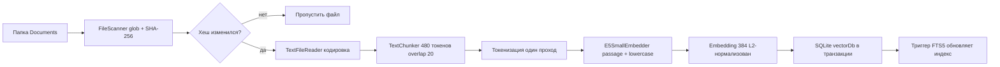
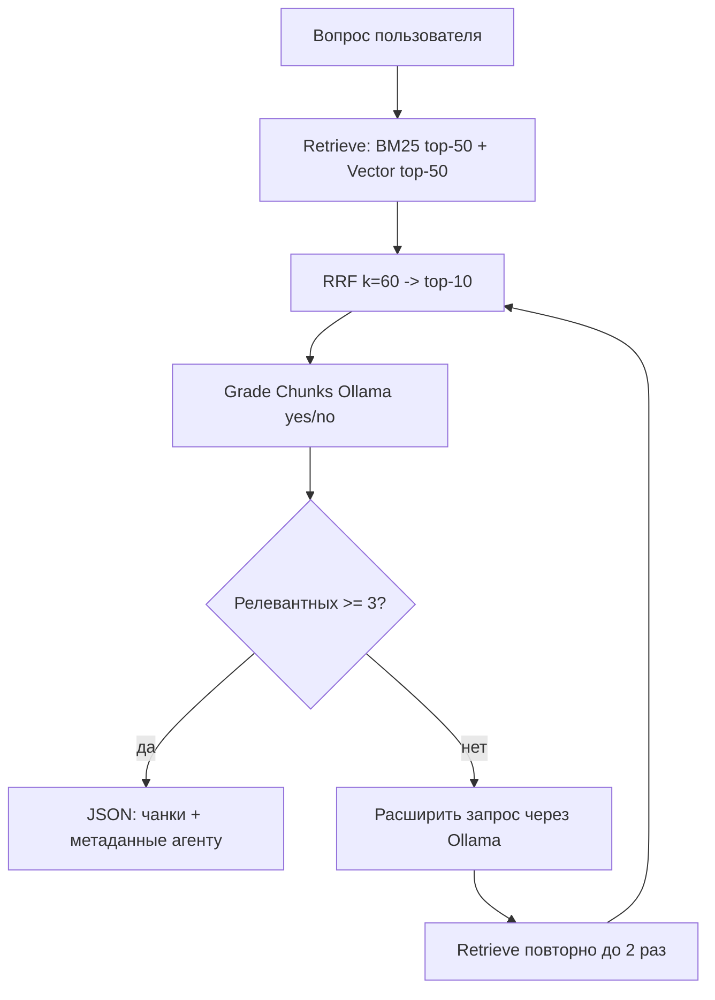

# План: MCP-сервер Corrective RAG на базе SQLite + multilingual-e5-small + Ollama

## 1. Цель

MCP-сервер на .NET 10 (ASP.NET Core, HTTP-транспорт Streamable), который:

- индексирует локальную папку с документами: чанкинг → эмбеддинги (ONNX `multilingual-e5-small`) → SQLite (`vectorDb.db`) с FTS5-индексом;
- при повторной индексации пропускает неизменённые файлы (SHA-256) и пересоздаёт изменившиеся;
- отвечает на запросы гибридным поиском: векторный + BM25 → RRF → топ-10;
- «корректирует» результат через локальную LLM (Ollama `qwen2.5:3b`): грейдинг релевантности чанков (yes/no) и расширение запроса при недостатке релевантных (до 2 итераций);
- финальный ответ формулирует агент-хост (Copilot/Claude в IDE), которому MCP отдаёт JSON с чанками и метаданными (файл, chunkId, score).

Ollama НЕ генерирует финальный ответ — только грейдинг и расширение запроса.
`find_relevant_docs` — вообще без LLM.

## 2. Уточнённые решения (по согласованию)

| Вопрос | Решение |
|---|---|
| Хеш файла | SHA-256 (в «Сущностях» было MD5 — противоречие, принят SHA-256) |
| Файл БД | `Resources/vectorDb.db`, путь из `appsettings.json` (`Database:Path`) |
| Ollama | OpenAI-совместимый API: `baseURL=http://localhost:11434/v1`, модель `qwen2.5:3b` (из конфига) |
| Порог релевантности | не менее 3 релевантных из топ-10 (настраивается в конфиге) |
| Финальный ответ | формирует агент-хост; MCP возвращает отобранные чанки + метаданные |
| Расширение запроса | через Ollama, если релевантных < порога, до 2 повторных поисков |

## 3. Архитектура

### 3.1 Индексация



### 3.2 Гибридный поиск и Corrective RAG



## 4. Структура проекта

```
otus-projectwork-rag/
├── Program.cs                     # DI, Serilog, MediatR, MCP-регистрация
├── appsettings.json               # БД, Ollama, чанкинг, пороги, пути к модели
├── Contracts/                     # DTO: IndexFolderResult, RelevantChunkResult,
│                                  # AskQuestionResult, IndexStatusResult
├── Domain/                        # Entities: Document, Chunk, Embedding
├── Infrastructure/
│   ├── Data/
│   │   ├── SqliteConnectionFactory.cs   # WAL, внешние ключи
│   │   ├── SchemaInitializer.cs         # DDL, триггеры FTS5, индексы
│   │   └── Repositories/
│   │       ├── DocumentRepository.cs
│   │       ├── ChunkRepository.cs
│   │       ├── EmbeddingRepository.cs
│   │       └── FtsRepository.cs
│   ├── Text/
│   │   ├── TextFileReader.cs     # BOM/кодировка, fallback Windows-1251
│   │   └── TextChunker.cs        # предложения + переносы строк, 480/20
│   ├── Embeddings/
│   │   ├── TokenizerProvider.cs  # Tokenizers.HuggingFace
│   │   └── E5SmallEmbedder.cs    # ONNX, mean pooling, L2, батчинг
│   ├── Search/
│   │   ├── VectorSearchService.cs
│   │   ├── Bm25SearchService.cs
│   │   ├── RrfFusion.cs
│   │   └── HybridSearchService.cs
│   ├── Ollama/
│   │   └── OllamaClient.cs       # /v1/chat/completions
│   └── Rag/
│       ├── ChunkGrader.cs        # грейдинг yes/no
│       ├── QueryExpander.cs      # расширение запроса
│       └── CorrectiveRagPipeline.cs
├── Features/                     # MediatR: Request + Handler рядом
│   ├── Indexing/IndexFolderRequest.cs
│   ├── Search/FindRelevantDocsQuery.cs
│   ├── Question/AskQuestionQuery.cs
│   └── Status/IndexStatusQuery.cs
└── Tools/
    └── RagTools.cs               # 4 MCP-инструмента ([McpServerTool])
```

## 5. Этапы реализации

### Этап 0 — Подготовка проекта
- NuGet: `MediatR 14.2.0`, `Microsoft.Data.Sqlite 10.0.12`, `Microsoft.ML.OnnxRuntime 1.30.0`, `Tokenizers.HuggingFace 3.23.1`, `Serilog.AspNetCore`, `Serilog.Sinks.File`.
- `appsettings.json`: секции `Database`, `Embedding` (путь к модели, batchSize), `Chunking` (maxTokens=480, overlap=20), `Retrieval` (bm25TopK=50, vectorTopK=50, rrfK=60, finalTopK=10, minRelevant=3, maxExpansions=2), `Ollama` (baseUrl, model).
- `csproj`: `<IncludeNativeLibrariesForSelfExtract>true</IncludeNativeLibrariesForSelfExtract>` для распаковки native ONNX при single-file publish; копирование `model_O4.onnx`, `tokenizer.json`, `tokenizer_config.json` в выходной каталог.

### Этап 1 — Индексация
1. Домен: `Document`, `Chunk`, `Embedding`.
2. `SqliteConnectionFactory` — singleton, `PRAGMA journal_mode=WAL`, `PRAGMA foreign_keys=ON`.
3. `SchemaInitializer` — создание таблиц по точному DDL из ТЗ + индексы `Chunks(DocumentId, ChunkIndex)` (UNIQUE) + триггеры FTS5:
   - `chunks_ai` AFTER INSERT → `INSERT INTO ChunksFts(rowid, Text) VALUES (new.Id, new.Text)`;
   - `chunks_ad` AFTER DELETE → `INSERT INTO ChunksFts(ChunksFts, rowid, Text) VALUES('delete', old.Id, old.Text)`.

   > Отклонение от ТЗ: триггер синхронизации FTS навешен на INSERT/DELETE по таблице `Chunks`, а не на удаление эмбеддинга. Это надёжнее: FTS очищается в момент удаления чанков (при переиндексации документа), не зависит от порядка удаления связанных строк и не требует CASCADE.

4. Репозитории получают `SqliteConnection` + `SqliteTransaction` из вызывающего кода (владелец транзакции — сервис индексации, атомарность «всё или ничего» на файл).
5. `TextFileReader`: чтение байтов → BOM (UTF-8/UTF-16) → строгий UTF-8 → fallback Windows-1251 (распространён для русских txt).
6. `TextChunker`: regex `(?<=[.!?…]\s*)(?=[А-ЯЁA-Z])|(?<=\r?\n)` (lookbehind сохраняет перевод строки). Куски склеиваются в чанки ≤480 токенов с перекрытием 20; число токенов каждого куска считается один раз.
7. `E5SmallEmbedder`: `Tokenizer.FromFile(tokenizer.json)`; текст приводится к нижнему регистру и получает префикс `passage: `; паддинг/тримминг до 512; батч-инференс; mean pooling по attention_mask; L2-нормализация; вектор — float32 LE, 1536 байт BLOB.
8. `IndexerService` + `IndexFolderCommand/Handler`: сканирование, сравнение SHA-256, полная переиндексация изменённых файлов (удаление старых чанков → триггер чистит FTS → вставка новых), пропуск неизменных.

### Этап 2 — Гибридный поиск
1. `VectorSearchService`: чтение всех векторов, косинус (dot product на нормализованных), топ-50.
2. `Bm25SearchService`: экранирование токенов запроса, `MATCH`, сортировка по `bm25(ChunksFts)`, топ-50.
3. `RrfFusion`: `score = Σ 1/(k + rank)`, k=60.
4. `HybridSearchService` + `FindRelevantDocsQuery/Handler`: 50 + 50 → RRF → топ-10.

### Этап 3 — Corrective RAG (Grade Chunks)
1. `OllamaClient`: POST `{baseUrl}/chat/completions` (OpenAI-совместимо), системный промпт, строгий JSON-ответ; таймаут и обработка ошибок.
2. `ChunkGrader`: вопрос + текст чанка → `{"relevant": true/false}` (нестрогий парсинг ответа).
3. `QueryExpander`: «сформулируй более широкий вариант запроса» → новая строка запроса.
4. `CorrectiveRagPipeline` + `AskQuestionQuery/Handler`: retrieve (без расширения) → grade топ-10 → если релевантных < 3 → expand → повторный retrieve (макс. 2 раза).

### Этап 4 — MCP-инструменты
Все инструменты — тонкий слой над MediatR (по скилу `mcp-csharp`: транспорт отделён от бизнес-логики), `[McpServerTool]` + `[Description]` с содержательным описанием для автоопределения хост-агентом.

| Инструмент | Вход | Выход (JSON) |
|---|---|---|
| `index_folder` | folderPath, globPattern=`*.txt` | scannedFiles, added, updated, unchanged, chunks, durationMs |
| `find_relevant_docs` | query, topK=10 | results[]: chunkId, documentId, fileName, filePath, vectorScore, bm25Score, rrfScore, text |
| `ask_question` | question | attempts, expandedQueries[], results[] (релевантные чанки с метаданными) |
| `index_status` | — | documentCount, chunkCount, embeddingCount, lastIndexedAt, databasePath |

Serilog: детальные логи в инструментах (Scopes), файл `logs/rag-.log` + консоль.

## 6. Развёртывание в Docker (конфигурация через переменные окружения)

Сервер будет жить в контейнере, Ollama — на хосте. Значит, вся конфигурация должна читаться из переменных окружения (в .NET они автоматически переопределяют `appsettings.json` через `Section__Key`), а не хардкодиться.

### 6.1 Ключевой нюанс: `localhost` в контейнере

Внутри контейнера `localhost` — это сам контейнер, а не хост с Ollama. Поэтому `Ollama__BaseUrl` обязан приходить из env и указывать на хост:
- Docker Desktop (Windows/Mac): `http://host.docker.internal:11434/v1`;
- Linux (docker run/compose): требуется `extra_hosts: ["host.docker.internal:host-gateway"]`, затем тот же адрес;
- альтернатива: если Ollama тоже в контейнере — имя сервиса в общей docker-сети (например, `http://ollama:11434/v1`).

### 6.2 Какие параметры передавать

| Переменная окружения | Зачем | Пример для Docker |
|---|---|---|
| `Ollama__BaseUrl` | адрес Ollama (хост!) | `http://host.docker.internal:11434/v1` |
| `Ollama__Model` | модель грейдинга/расширения | `qwen2.5:3b` |
| `Database__Path` | путь к БД в контейнере (том) | `/dataBaseDocker/vectorDb.db` |
| `Embedding__ModelDirectory` | каталог с ONNX-моделью (обычно зашит в образ) | `/app/Resources/multilingual-e5-small` |
| `Indexing__DefaultGlob` | глоб по умолчанию | `*.txt` |
| `ASPNETCORE_URLS` | порт HTTP в контейнере | `http://+:8080` |
| `Serilog__MinimumLevel` | уровень логов (в контейнере — stdout) | `Information` |

Опционально (тоже env): `Chunking__MaxTokens`, `Chunking__OverlapTokens`, `Retrieval__Bm25TopK`, `Retrieval__VectorTopK`, `Retrieval__RrfK`, `Retrieval__FinalTopK`, `Retrieval__MinRelevant`, `Retrieval__MaxExpansions`.

Папка с документами НЕ настраивается в конфиге — она передаётся как параметр инструмента `index_folder` (в контейнер монтируется том, например `/docsDocker`, и хост-агент вызывает `index_folder("/docsDocker", "*.txt")`).

### 6.3 Тома и проброс порта

- `./dataBaseDocker:/dataBaseDocker` — чтобы БД `vectorDb.db` переживала пересоздание контейнера;
- `./docsDocker:/docsDocker` — папка, которую индексируем;
- порт: контейнер слушает 8080, наружу пробрасывается, например, 6543 → MCP-клиент подключается к `http://localhost:6543` как раньше.

### 6.4 Правки в коде, нужные для Linux-контейнера

- **`windows-1251`**: на .NET Core `Encoding.GetEncoding("windows-1251")` бросает исключение без явной регистрации провайдера — в `Program.cs` добавить `Encoding.RegisterProvider(CodePagesEncodingProvider.Instance)`.
- **Single-file + ONNX**: при `PublishSingleFile` native-библиотеки должны распаковываться в рантайме — флаг `<IncludeNativeLibrariesForSelfExtract>true</IncludeNativeLibrariesForSelfExtract>` (уже в плане).
- **Логирование**: Serilog пишет ОДНОВРЕМЕННО в stdout (Console-силка) и в файл (`logs/rag-.log`, rolling); минимальный уровень — `Information` (настраивается через `Serilog__MinimumLevel`). В контейнере путь лог-файла должен указывать на смонтированный том (например, `/logsDocker/rag-.log`), иначе логи не переживут пересоздание контейнера.

### 6.5 Пример docker-compose.yml

```yaml
services:
  rag-mcp:
    build: .
    ports:
      - "6543:8080"
    environment:
      ASPNETCORE_URLS: "http://+:8080"
      Ollama__BaseUrl: "http://host.docker.internal:11434/v1"
      Ollama__Model: "qwen2.5:3b"
      Database__Path: "/dataBaseDocker/vectorDb.db"
      Indexing__DefaultGlob: "*.txt"
    volumes:
      - ./dataBaseDocker:/dataBaseDocker
      - ./docsDocker:/docsDocker
      - ./logsDocker:/logsDocker
    extra_hosts:
      - "host.docker.internal:host-gateway"   # Linux; Docker Desktop не требует
```

### 6.6 Dockerfile (multi-stage, self-contained linux-x64)

```
FROM mcr.microsoft.com/dotnet/sdk:10.0 AS build
WORKDIR /src
COPY . .
RUN dotnet publish otus-projectwork-rag.csproj -c Release -r linux-x64 \
    --self-contained true -o /app/publish

FROM mcr.microsoft.com/dotnet/aspnet:10.0 AS runtime
WORKDIR /app
COPY --from=build /app/publish .
# Модель и токенизатор уже внутри /app/Resources (CopyToOutputDirectory)
EXPOSE 8080
ENTRYPOINT ["/app/otus-projectwork-rag"]
```

### 6.7 Локальная разработка

Тот же механизм env можно использовать вне Docker: `launchSettings.json` (секция `environmentVariables`) или `.env`-файл — значения будут переопределять `appsettings.json`.

## 7. Риски и особенности

- **Имена входов/выходов ONNX-модели** `model_O4.onnx`: вход `token_type_ids` ОБЯЗАТЕЛЕН — передаём нулевой тензор (batch × seq), `input_ids` и `attention_mask` int64; фактические имена всё равно проверить через `InferenceSession.InputMetadata/OutputMetadata`. Выход — `last_hidden_state`, далее mean pooling по attention_mask + L2.
- **Native-библиотеки ONNX** при `PublishSingleFile` — обязательна самовыгрузка (`IncludeNativeLibrariesForSelfExtract`), иначе упадёт на рантайме.
- **FTS5-запрос** требует экранирования спецсимволов, иначе `MATCH` выбросит исключение.
- **Векторный поиск** — полный перебор (brute force): для учебного объёма (~сотни чанков × 384) мгновенно; ANN-индекс не нужен.
- **BM25 «в памяти»** — не реализуется: FTS5-индекс живёт в SQLite и синхронизируется триггерами, это штатный механизм.
- **Кодировки**: строгий UTF-8 → fallback Windows-1251; на Linux работает одинаково.
- **Транспорт**: остаётся HTTP Streamable (`http://localhost:6543`, Stateless), как настроено в шаблоне и README.